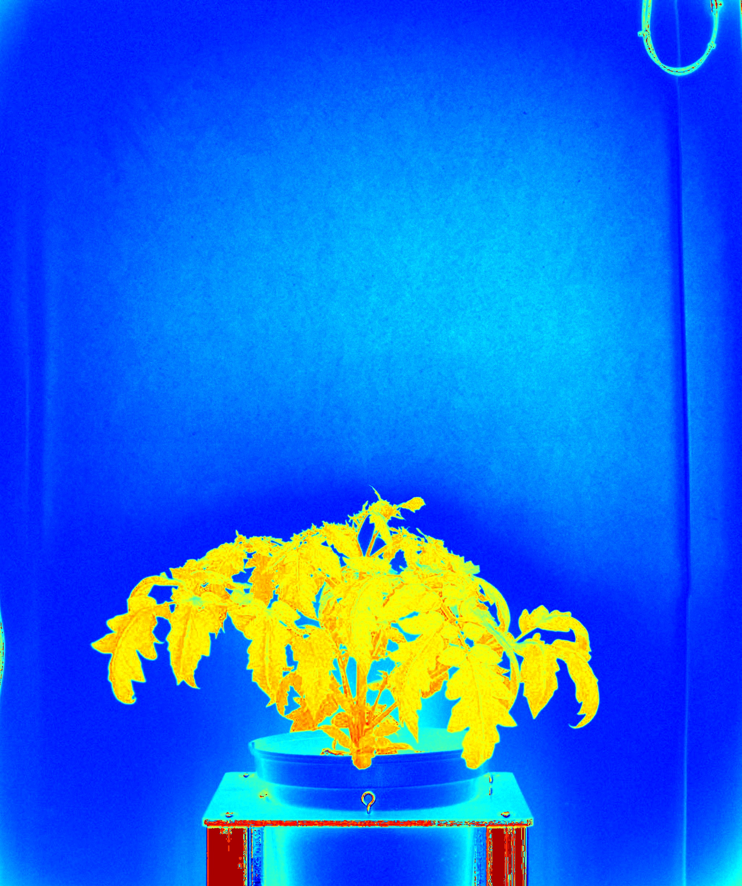

# Image from distances

## Description

Build an image from distance calculation
**Real time**: True

## Usage

- **Pre processing**: Transform the image to help segmentation,
  the image may not retain it's
  properties. Changes here will be ignored when extracting features

## Parameters

- Activate tool (enabled): Toggle whether or not tool is active (default: 1)
- Channel (channel_1): (default: h)
- Transformation applied to channel 1 (transformation_1): (default: none)
- Channel (channel_2): (default: none)
- Transformation applied to channel 2 (transformation_2): (default: none)
- Channel (channel_3): (default: none)
- Transformation applied to channel 3 (transformation_3): (default: none)
- Distance origin (origin): Can be zero, the mean or median colour or a selected one. (default: zero)
- Distance (distance): (default: l1)
- Target IPT (tool_target): no clue (default: none)
- Name of ROI to be used (roi_names): Operation will only be applied inside of ROI (default: )
- ROI selection mode (roi_selection_mode): (default: all_linked)
- Select pseudo color map (color_map): (default: c_2)
- Overlay text on top of images (text_overlay): Draw description text on top of images (default: 0)
- Displayed output (build_mosaic): Choose mosaic type to display (default: no)

## Example

### Source

--(2019-07-04 10_00_00)--(TomatoSampleExperiment)--(vis-side0).jpg)

### Parameters/Code

Default values are not needed when calling function

```python
from ipapi.ipt import call_ipt

image = call_ipt(
    ipt_id="IptThresholdDistance",
    source="(TomatoSamplePlant)--(2019-07-04 10_00_00)--(TomatoSampleExperiment)--(vis-side0).jpg",
    return_type="result",
    channel_2='b',
    channel_3='gr',
    origin='blue_violet',
    distance='l2'
)
```

### Result


