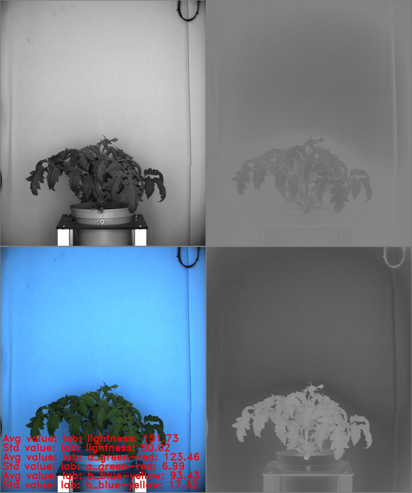

# Image statistics

## Description

Displays image color statistics<br>

**Real time**: True

## Usage

- **Feature extraction**: Tools to extract features from a segmented image

## Parameters

- Select source file type (source_file): no clue (default: source)
- Color space (color_space): no clue (default: LAB)

---

- output (channel_1_avg): Average pixel value for lab: lightness
- output (channel_1_std): Standard deviation for lab: lightness
- output (channel_2_avg): Average pixel value for lab: a_green-red
- output (channel_2_std): Standard deviation for lab: a_green-red
- output (channel_3_avg): Average pixel value for lab: b_blue-yellow
- output (channel_3_std): Standard deviation for lab: b_blue-yellow

## Example

### Source


### Parameters/Code

Default values are not needed when calling function

```python
from ipapi.ipt import call_ipt

call_ipt(ipt_id="IptImageStats",
         source="tomato_sample_plant.jpg",
         )
```

### Result


