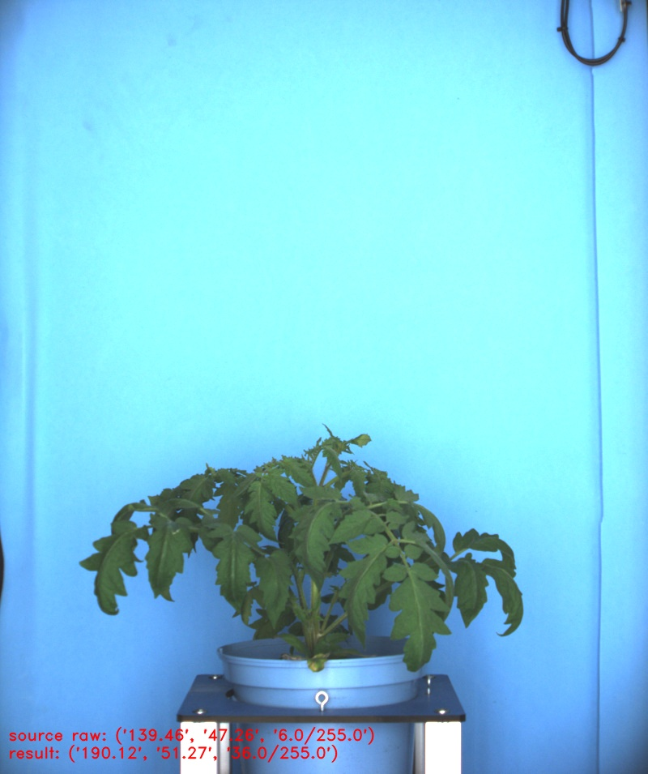

# Image transformations

## Description

Performs various transformations on the image<br>**Real time**: True

## Usage

- **Pre-processing**: Transform the image to help segmentation, the image may not retain it's properties. Changes here will be ignored when extracting features
- **Image checking**: Check different aspects of an image
- **Feature extraction**: Tools to extract features from a segmented image
- **Exposure fixing**: Fix image exposure, the resulting image will be used for color analysis

## Parameters

- Activate tool (enabled): Toggle whether or not tool is active (default: 1)
- Select transformation (method): (default: alpha_beta)
- Apply smart transformation if (apply_case): (default: always)
- Alpha/Gamma (alpha_gamma): Alpha value for linear transformation, gamma for gamma correction (default: 100)
- Beta (brightness) (beta): (default: 0)
- Target brightness (target_brightness): (default: 0)
- Limit brightness fixing (max_delta_for_brightness): (default: 255)
- Show over an under exposed parts (show_over_under): (default: 0)
- Brightness calculation mode (brg_calc): (default: std)
- Overlay text on top of images (text_overlay): Draw description text on top of images (default: 0)

---

- output (tb_output): ('Image', 'Brightness average', 'Contrast average', 'Brightness min/max')

## Example

### Source


### Parameters/Code

Default values are not needed when calling function

```python
from ipapi.ipt import call_ipt

image = call_ipt(ipt_id="IptLinearTransformation",
                 source="tomato_sample_plant.jpg",
                 method='alpha_beta_target',
                 target_brightness=197,
                 text_overlay=1)
```

### Result


