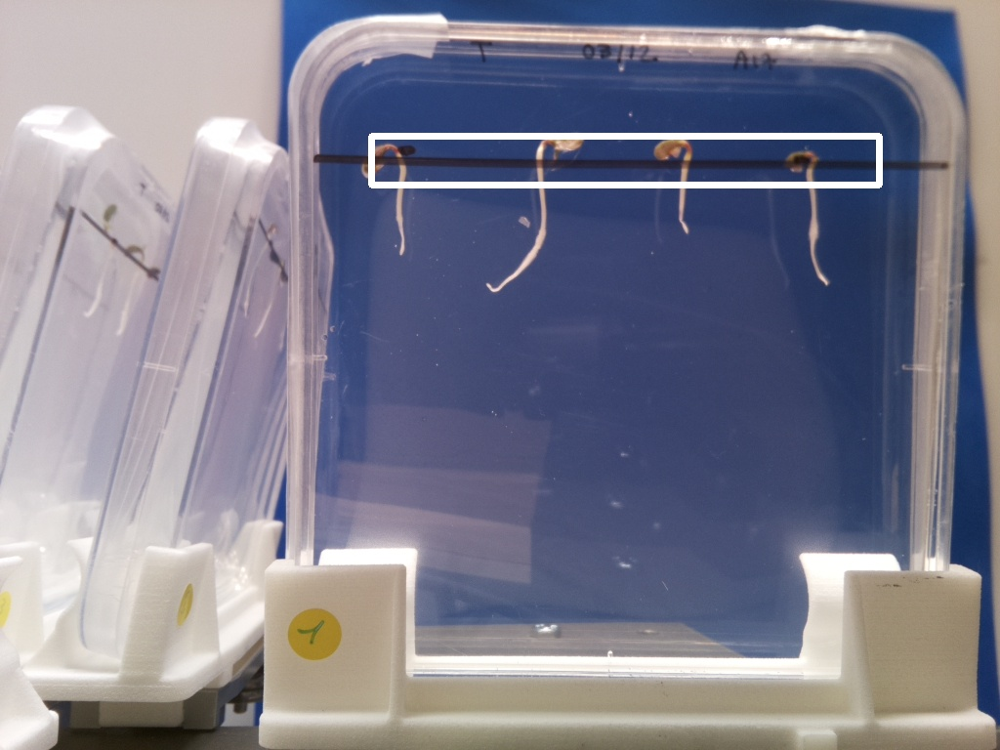
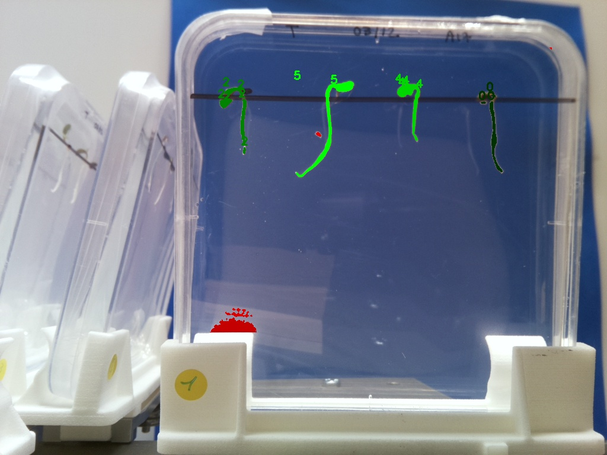

# Keep contours near ROIs

## Description

Keep big contours inside a series of ROIs.  
Small contours inside ROIs may be added on conditions.  
Contours outside ROIs may be added to root contours if close enough
**Real time**: False

## Usage

- **Mask cleanup**: Cleans a coarse mask generated by threshold tools

## Parameters

- Activate tool (enabled): Toggle whether or not tool is active (default: 1)
- Name of ROI to be used (roi_names): Operation will only be applied inside of ROI (default: )
- ROI selection mode (roi_selection_mode): (default: all_linked)
- Maximum distance to ROI (init_max_distance): Maximum distance to add a contour on initialization phase.
  If distance is >0, ROIs will dilated with a kernel of size distance. (default: 0)
- Minimum contour size (init_min_size): Minimum accepted size for a contour on initialization phase (default: 100)
- Delete all contours smaller than (delete_all_bellow): All contours below this size will be permanently ignored.
  The more smaller contours are delete, the faster the algorithm (default: 0)
- Merge distance for root contours (root_merge_distance): (default: 100)
- Aggregate small contours inside ROIs distance (small_contours_distance_tolerance): Aggregate small contours inside ROIs if closer than x to any root contour.
  Any aggregated contour is considered as a root one. (default: 100)
- Aggregate unknown contours distance (unk_contours_distance_tolerance): Aggregate unknown contours if closer than x to any root contour.
  Any aggregated contour is considered as a root one. (default: 100)

## Example

### Source



### Parameters/Code

Default values are not needed when calling function

```python
from ipapi.ipt import call_ipt

mask = call_ipt(
    ipt_id="IptKeepCountoursNearRois",
    source="rr_exp2_j1 (1).jpg",
    return_type="result"
)
```

### Result


