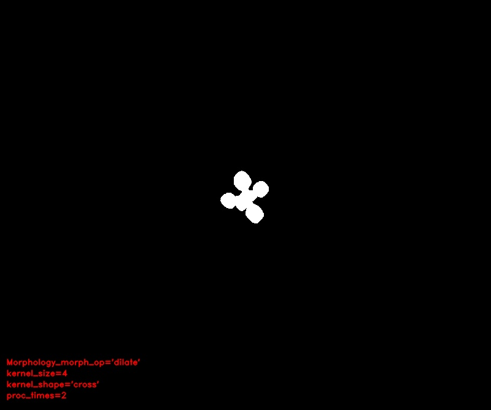

# Morphology

## Description

Morphology: Applies the selected morphology operator.  
Needs to be part of a pipeline where a mask has already been generated.

**Real time**: False

## Usage

- **Mask cleanup**: Cleans a coarse mask generated by threshold tools

## Parameters

- Morphology operator (morph_op): (default: none)
- Kernel size (kernel_size): (default: 3)
- Kernel shape (kernel_shape): (default: ellipse)
- Iterations (proc_times): (default: 1)

## Example

### Source


### Parameters/Code

Default values are not needed when calling function

```python
from ipapi.ipt import call_ipt

mask = call_ipt(ipt_id="IptMorphology",
                source="arabido_sample_plant.jpg",
                morph_op='dilate',
                kernel_size=4,
                kernel_shape='cross',
                proc_times=2)
```

### Result


