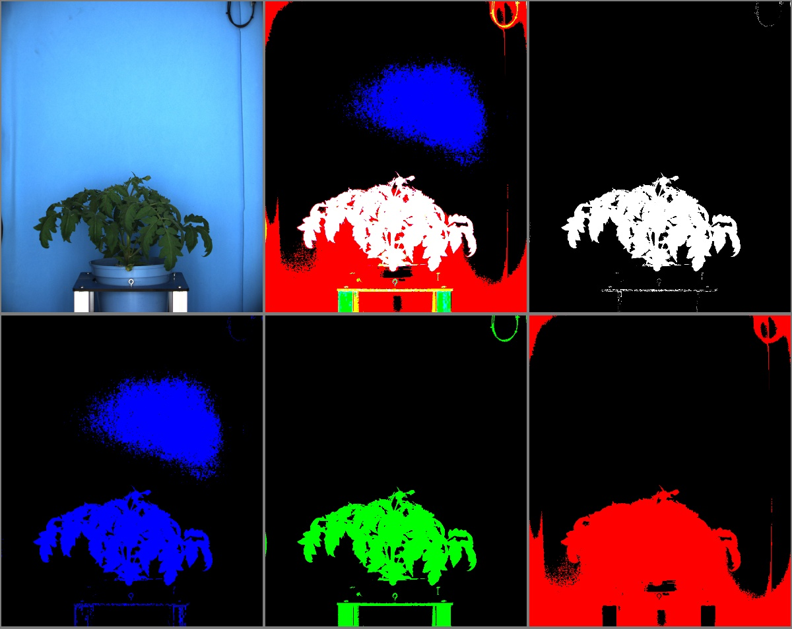

# Multi range threshold

## Description

Performs range threshold keeping only pixels with values between min and max for up to 3 channels.  
Morphology operation can be performed afterwards  
**Real time**: True

## Usage

- **Threshold**: Creates a mask that keeps only parts of the image
- **Visualization**: Visualization tools

## Parameters

- Activate tool (enabled): Toggle whether or not tool is active (default: 1)
- Channel 1 (c1): (default: h)
- Min threshold for channel 1 (c1_low): (default: 0)
- Max threshold for channel 1 (c1_high): (default: 255)
- Channel 2 (c2): (default: none)
- Min threshold for channel 2 (c2_low): (default: 0)
- Max threshold for channel 2 (c2_high): (default: 255)
- Channel 3 (c3): (default: none)
- Min threshold for channel 3 (c3_low): (default: 0)
- Max threshold for channel 3 (c3_high): (default: 255)
- How to merge thresholds (merge_mode): (default: multi_and)
- Morphology operator (morph_op): (default: none)
- Kernel size (kernel_size): (default: 3)
- Kernel shape (kernel_shape): (default: ellipse)
- Iterations (proc_times): (default: 1)
- Overlay text on top of images (text_overlay): Draw description text on top of images (default: 0)
- Build mosaic (build_mosaic): If true edges and result will be displayed side by side (default: 0)

## Example

### Source


### Parameters/Code

Default values are not needed when calling function

```python
from ipapi.ipt import call_ipt

mask = call_ipt(
    ipt_id="IptMultiRangeThreshold",
    source="tomato_sample_plant.jpg",
    return_type="result",
    c1_low=20,
    c1_high=100,
    c2='b',
    c2_low=120,
    c3='v',
    c3_low=10,
    c3_high=200,
    build_mosaic=1
)
```

### Result


