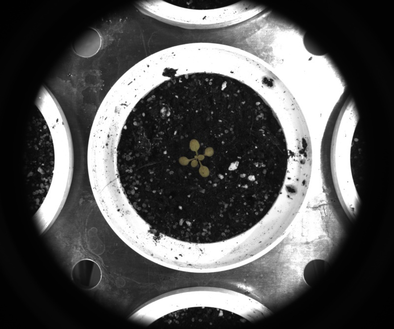

# Observation data

## Description

Returns observation data retrieved from the image file<br>**Real time**: False

## Usage

- **Feature extraction**: Tools to extract features from a segmented image

## Parameters

- experiment (experiment): (default: 1)
- plant (plant): (default: 1)
- date_time (date_time): (default: 1)
- camera (camera): (default: 1)
- view_option (view_option): (default: 1)
- Split plant name into multiple variables (split_plant_name): (default: 0)
- Character to use as separator (separator): (default: \_)
- Names of new variables (new_column_names): names separate by "," with no spaces (default: )

---

## Example

### Source


### Parameters/Code

Default values are not needed when calling function

```python
from ipapi.ipt import call_ipt

dictionary = call_ipt(ipt_id="IptAnalyseObservation",
                      source="arabido_sample_plant.jpg",
                      )
```

### Result image



### Result data

|     key     |        Value         |
| :---------: | :------------------: |
| experiment  |        images        |
|    plant    | arabido_sample_plant |
|  date_time  | 2019-07-24 10:08:22  |
|   camera    |       unknown        |
| view_option |         .jpg         |
|    tray     |       arabido        |
|  treatment  |        sample        |
|     id      |        plant         |
