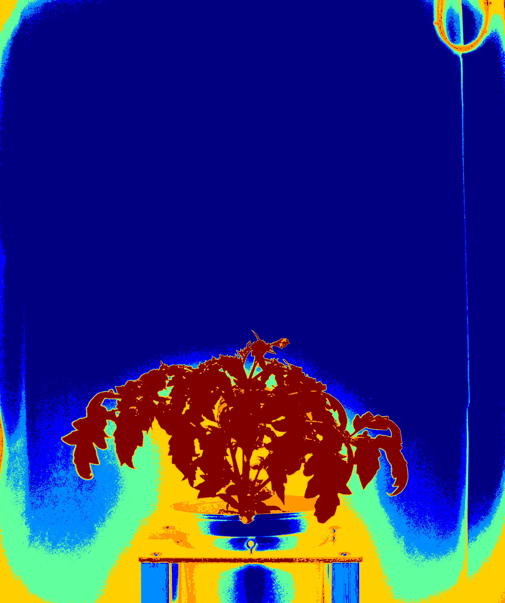

# Otsu merger

## Description

Based on Otsu's binarization, create a new image from OTSU channel binarization.
**Real time**: True

## Usage

- **Pre processing**: Transform the image to help segmentation,
  the image may not retain it's
  properties. Changes here will be ignored when extracting features

## Parameters

- Merge method: (merge_method): Selected merge method (default: squares)
- Channel hue behaviour: (h): Select channel hsv: hue behaviour (default: active)
- Channel saturation behaviour: (s): Select channel hsv: saturation behaviour (default: active)
- Channel lightness behaviour: (l): Select channel lab: lightness behaviour (default: active)
- Channel a_green-red behaviour: (a): Select channel lab: a_green-red behaviour (default: active)
- Channel b_blue-yellow behaviour: (b): Select channel lab: b_blue-yellow behaviour (default: active)
- Channel red behaviour: (rd): Select channel rgb: red behaviour (default: active)
- Channel green behaviour: (gr): Select channel rgb: green behaviour (default: active)
- Channel blue behaviour: (bl): Select channel rgb: blue behaviour (default: active)
- Select pseudo color map (color_map): (default: c_2)
- Normalize channel (normalize): (default: 0)
- Build mosaic (build_mosaic): Choose mosaic type to display (default: no)

## Example

### Source

--(2019-07-04 10_00_00)--(TomatoSampleExperiment)--(vis-side0).jpg)

### Parameters/Code

Default values are not needed when calling function

```python
from ipapi.ipt import call_ipt

mask = call_ipt(
    ipt_id="IptOtsuOverthinked",
    source="(TomatoSamplePlant)--(2019-07-04 10_00_00)--(TomatoSampleExperiment)--(vis-side0).jpg",
    return_type="result",
    merge_method='w_and',
    h='inverted',
    s='disabled',
    l='inverted',
    a='disabled',
    rd='inverted',
    gr='inverted',
    bl='inverted'
)
```

### Result


