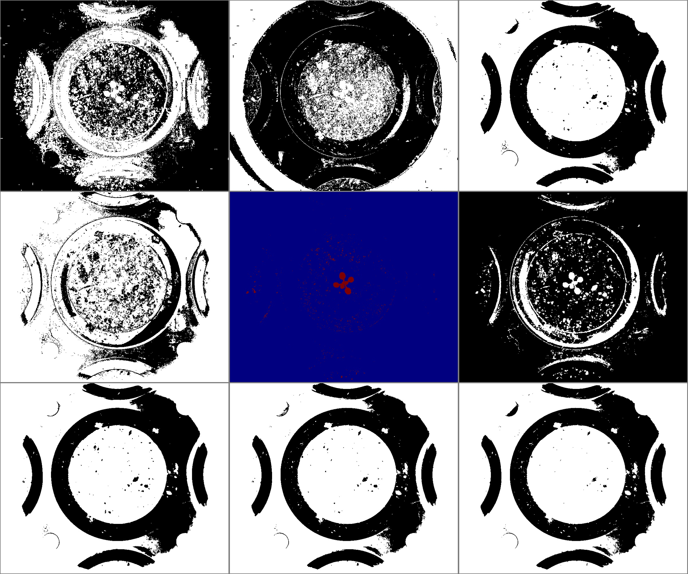

# Otsu overthinked

## Description

Based on Otsu's binarization, uses a costum set of channels.<br>**Real time**: True

## Usage

- **Threshold**: Creates a mask that keeps only parts of the image
- **Pre-processing**: Transform the image to help segmentation, the image may not retain it's properties. Changes here will be ignored when extracting features

## Parameters

- Select source file type (source_file): no clue (default: source)
- Merge method: (merge_method): Selected merge method (default: squares)
- Channel hue behaviour: (h): Select channel hsv: hue behaviour (default: active)
- Channel saturation behaviour: (s): Select channel hsv: saturation behaviour (default: active)
- Channel lightness behaviour: (l): Select channel lab: lightness behaviour (default: active)
- Channel a_green-red behaviour: (a): Select channel lab: a_green-red behaviour (default: active)
- Channel b_blue-yellow behaviour: (b): Select channel lab: b_blue-yellow behaviour (default: active)
- Channel red behaviour: (rd): Select channel rgb: red behaviour (default: active)
- Channel green behaviour: (gr): Select channel rgb: green behaviour (default: active)
- Channel blue behaviour: (bl): Select channel rgb: blue behaviour (default: active)
- Select pseudo color map (color_map): (default: c_2)
- use color palette (use_palette): Use color palette in postprocessing (default: 0)
- Normalize channel (normalize): (default: 0)
- Build mosaic (build_mosaic): Choose mosaic type to display (default: no)

---

## Example

### Source


### Parameters/Code

Default values are not needed when calling function

```python
from ipapi.ipt import call_ipt

mask = call_ipt(ipt_id="IptOtsuOverthinked",
                source="arabido_sample_plant.jpg",
                merge_method='l_and',
                h='inverted',
                l='inverted',
                a='inverted',
                rd='inverted',
                gr='inverted',
                bl='inverted',
                use_palette=1,
                normalize=1,
                build_mosaic='channels')
```

### Result


