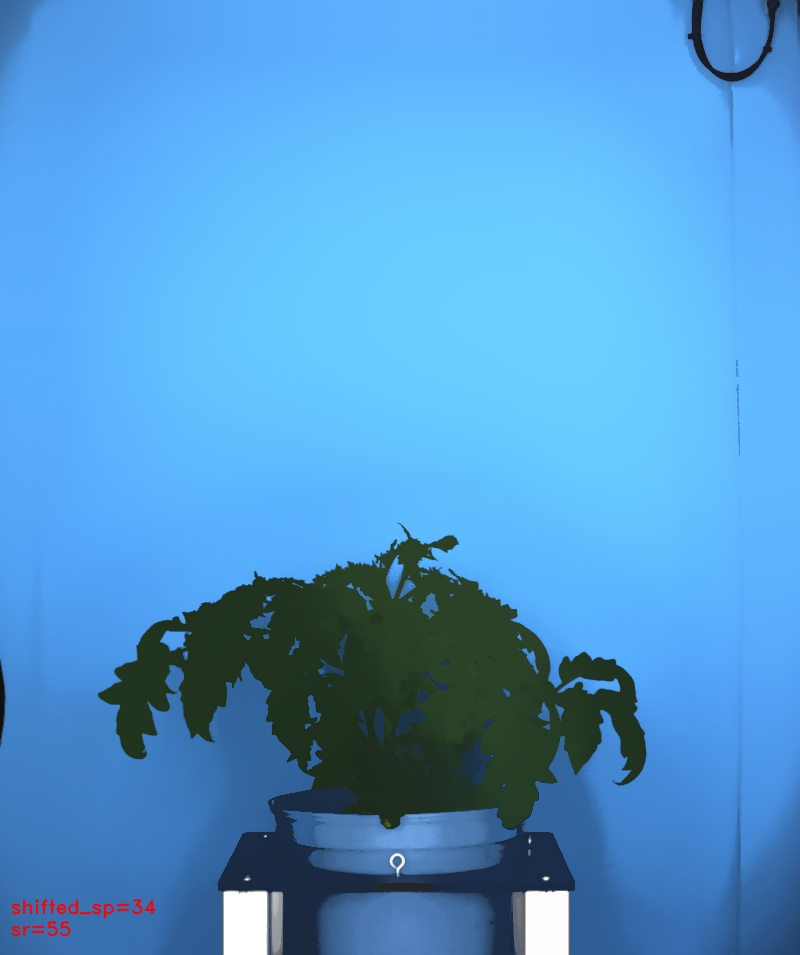

# Pyramid mean shift

## Description

Pyramid mean shift: A kind of posterization<br>**Real time**: False

## Usage

- **Pre-processing**: Transform the image to help segmentation, the image may not retain it's properties. Changes here will be ignored when extracting features

## Parameters

- Spatial window radius (sp): (default: 4)
- Color window radius (sr): (default: 10)

## Example

### Source


### Parameters/Code

Default values are not needed when calling function

```python
from ipapi.ipt import call_ipt

image = call_ipt(ipt_id="IptPyramidMeanShift",
                 source="tomato_sample_plant.jpg",
                 sp=34,
                 sr=55)
```

### Result


