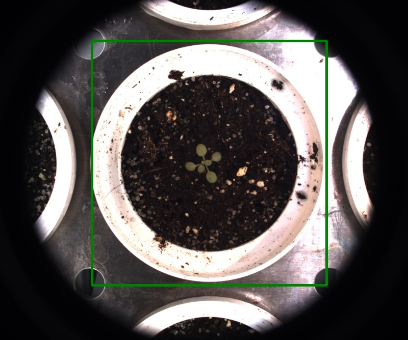

# Rectangle ROI

## Description

Create rectangle ROIs
**Real time**: True

## Usage

- **ROI (static)**: Create a ROI from coordinates

## Parameters

- ROI name (roi_name): (default: unnamed_roi)
- Select action linked to ROI (roi_type): no clue (default: keep)
- Target IPT (tool_target): no clue (default: none)
- Left (left): (default: 0)
- Width (width): (default: 0)
- Top (top): (default: 0)
- Height (height): (default: 0)
- Apply to images that match (apply_case): List of key values pairs separated by |, to use list as value separate with ',' (default: )
- Launch ROI draw form (draw_roi): Launch OpenCV window to select a ROI (default: 0)

## Example

### Source


### Parameters/Code

Default values are not needed when calling function

```python
from ipapi.ipt import call_ipt

call_ipt(
    ipt_id="IptRectangleRoi",
    source="arabido_small.jpg",
    return_type="result",
    roi_name='demo_rect',
    left=180,
    width=460,
    top=80,
    height=480
)
```

### Result


