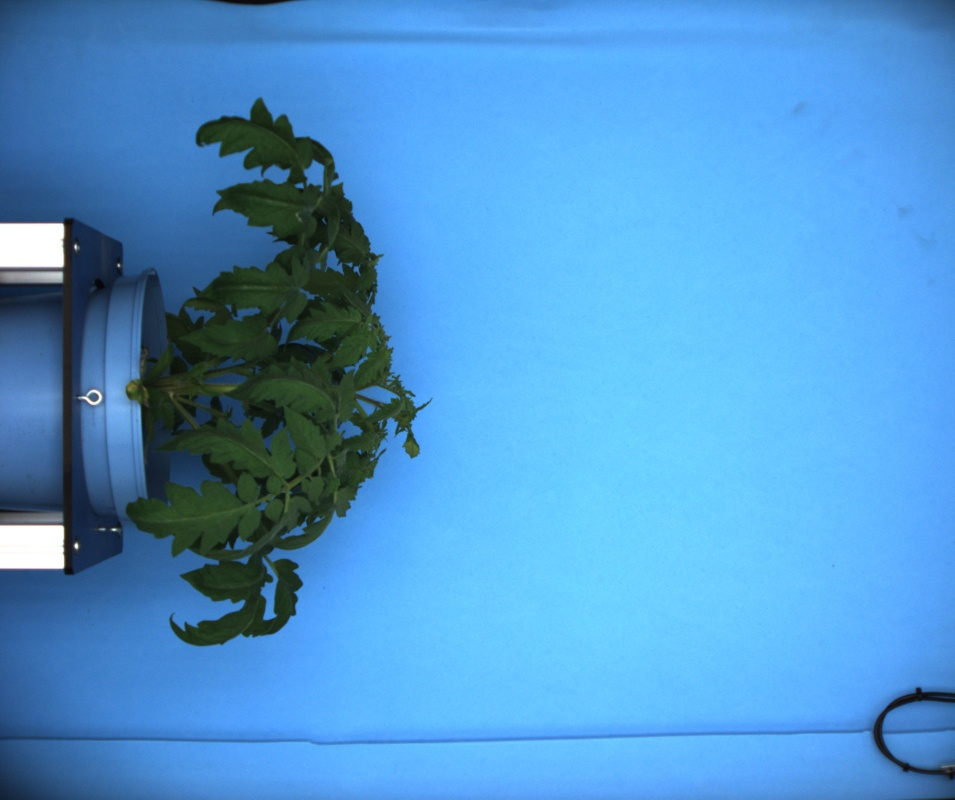

# Rotate

## Description

Rotates an image according to selected angle  
**Real time**: True

## Usage

- **Exposure fixing**: Fix image exposure, the resulting image will be used for color analysis
- **Image generator**: Creates one or more images from a selected image
- **Pre processing**: Transform the image to help segmentation, the image may not retain it's
  properties. Changes here will be ignored when extracting features
- **Visualization**: Visualization tools

## Parameters

- Activate tool (enabled): Toggle whether or not tool is active (default: 1)
- Rotation angle (rotate_angle): Select the angle to rotate the image (default: a0)

## Example

### Source


### Parameters/Code

Default values are not needed when calling function

```python
from ipapi.ipt import call_ipt

image = call_ipt(
    ipt_id="IptRotate",
    source="tomato_sample_plant.jpg",
    return_type="result",
    rotate_angle='a90'
)
```

### Result


