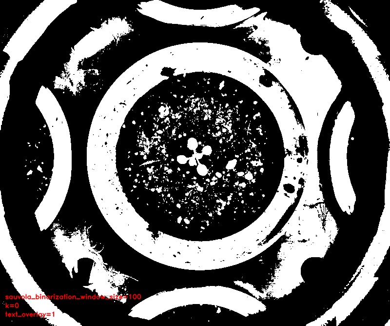

# Sauvola binarization

## Description

Sauvola binarization: From skimage - Applies Sauvola local threshold to an array. Sauvola is a modification of Niblack technique.<br><br> In the original method a threshold T is calculated for every pixel in the image using the following formula:<br><br> T = m(x,y) _ (1 + k _ ((s(x,y) / R) - 1))<br> where m(x,y) and s(x,y) are the mean and standard deviation of pixel (x,y)<br> neighborhood defined by a rectangular window with size w times w centered around the pixel.<br> k is a configurable parameter that weights the effect of standard deviation. R is the maximum standard deviation<br> of a greyscale image.<br>**Real time**: True

## Usage

- **Threshold**: Creates a mask that keeps only parts of the image

## Parameters

- Channel (channel): (default: l)
- Invert mask (invert_mask): Invert result (default: 0)
- Window size (window_size): (default: 25)
- k threshold formula (k): (default: 20)
- Morphology operator (morph_op): (default: none)
- Kernel size (kernel_size): (default: 3)
- Kernel shape (kernel_shape): (default: ellipse)
- Iterations (proc_times): (default: 1)
- Overlay text on top of images (text_overlay): Draw description text on top of images (default: 0)

## Example

### Source


### Parameters/Code

Default values are not needed when calling function

```python
from ipapi.ipt import call_ipt

mask = call_ipt(ipt_id="IptSauvola",
                source="arabido_sample_plant.jpg",
                window_size=100,
                k=0,
                text_overlay=1)
```

### Result


