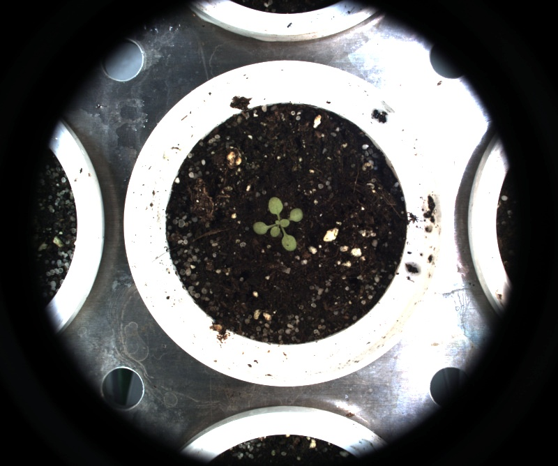

# Simple white balance

## Description

Simple white balance: Performs a simple white balance.<br>https://www.ipol.im/pub/art/2011/llmps-scb/article.pdf<br>**Real time**: True

## Usage

- **Pre-processing**: Transform the image to help segmentation, the image may not retain it's properties. Changes here will be ignored when extracting features
- **White balance**: Tools to help change white balance, depending on where those tools are set in the pipeline they or may not be ignored when extracting features
- **Exposure fixing**: Fix image exposure, the resulting image will be used for color analysis

## Parameters

- Color space (color_space): no clue (default: RGB)
- Median filter size (odd values only) (median_filter_size): (default: 0)
- Threshold min % (min): (default: 2)
- Threshold max % (max): (default: 2)
- Overlay text on top of images (text_overlay): Draw description text on top of images (default: 0)

## Example

### Source


### Parameters/Code

Default values are not needed when calling function

```python
from ipapi.ipt import call_ipt

image = call_ipt(ipt_id="IptSimpleWhiteBalance",
                 source="arabido_sample_plant.jpg",
                 min=11,
                 max=24)
```

### Result


