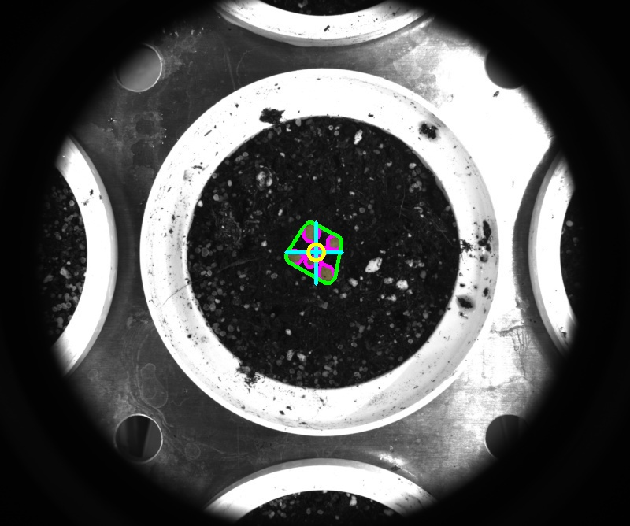
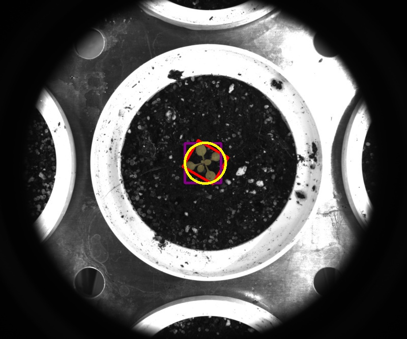

# Analyze object

## Description

Analyses object and returns morphologic data.<br>
Needs a mask as an input.<br>
Normally used in a pipeline after a clean mask is created.<br>

**Real time**: Does not apply

## Usage

- **Feature extraction**: Tools to extract features from a segmented image

## Parameters

- Area (area): (default: 1)
- Centroid x (centroid_x): (default: 1)
- Centroid y (centroid_y): (default: 1)
- Convex hull area (hull_area): (default: 1)
- Shape solidity (shape_solidity): (default: 1)
- Shape extend (shape_extend): (default: 1)
- Straight bounding rectangle left (straight_bounding_rectangle_left): (default: 1)
- Straight bounding rectangle width (straight_bounding_rectangle_width): (default: 1)
- Straight bounding rectangle top (straight_bounding_rectangle_top): (default: 1)
- Straight bounding rectangle height (straight_bounding_rectangle_height): (default: 1)
- Rotated bounding rectangle cx (rotated_bounding_rectangle_cx): (default: 1)
- Rotated bounding rectangle cy (rotated_bounding_rectangle_cy): (default: 1)
- Rotated bounding rectangle width (rotated_bounding_rectangle_width): (default: 1)
- Rotated bounding rectangle height (rotated_bounding_rectangle_height): (default: 1)
- Rotated bounding rectangle rotation (rotated_bounding_rectangle_rotation): (default: 1)
- Minimum enclosing circle cx (minimum_enclosing_circle_cx): (default: 1)
- Minimum enclosing circle cy (minimum_enclosing_circle_cy): (default: 1)
- Minimum enclosing circle radius (minimum_enclosing_circle_radius): (default: 1)
- Shape height (shape_height): (default: 1)
- Shape width (shape_width): (default: 1)
- Shape minimum width (shape_width_min): (default: 1)
- Shape maximum width (shape_width_max): (default: 1)
- Shape average width (shape_width_avg): (default: 1)
- Shape width standard deviation (shape_width_std): (default: 1)
- Select amount of quantiles for width analysis (quantile_width): (default: 4)

## Example

### Source


### Parameters/Code

Default values are not needed when calling function

```python
from ipapi.ipt import call_ipt

dictionary = call_ipt(ipt_id="IptAnalyzeObject",
                      source="arabido_sample_plant.jpg",
                      )
```

### Result images





### Result data

|                 key                 |        Value        |
| :---------------------------------: | :-----------------: |
|                area                 |       1871.0        |
|             centroid_x              | 401.11437733832173  |
|             centroid_y              | 320.52431854623194  |
|              hull_area              |       3532.5        |
|           shape_solidity            |  0.52965322009908   |
|            shape_extend             | 0.33784759841097867 |
|  straight_bounding_rectangle_left   |         363         |
|  straight_bounding_rectangle_width  |         71          |
|   straight_bounding_rectangle_top   |         282         |
| straight_bounding_rectangle_height  |         78          |
|    rotated_bounding_rectangle_cx    |  404.1307678222656  |
|    rotated_bounding_rectangle_cy    |  319.6461486816406  |
|  rotated_bounding_rectangle_width   |  68.3431396484375   |
|  rotated_bounding_rectangle_height  |  59.78473663330078  |
| rotated_bounding_rectangle_rotation |  119.7448844909668  |
|     minimum_enclosing_circle_cx     |  403.3448181152344  |
|     minimum_enclosing_circle_cy     | 321.39654541015625  |
|   minimum_enclosing_circle_radius   |  40.73220443725586  |
|            shape_height             |         78          |
|             shape_width             |         71          |
|           shape_width_min           |          2          |
|           shape_width_max           |         51          |
|           shape_width_avg           | 29.576923076923077  |
|           shape_width_std           |  13.15345253572109  |
