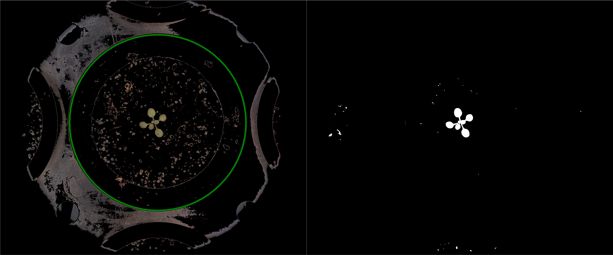

# Apply ROI

## Description

Apply selected ROI to image/mask  
ROI can be of type "keep", "delete", "erode", "dilate", "open", "close"  
 Select correct IO type for pipeline use
**Real time**: True

## Usage

- **Pre processing**: Transform the image to help segmentation,
  the image may not retain it's
  properties. Changes here will be ignored when extracting features
- **Mask cleanup**: Cleans a coarse mask generated by threshold tools

## Parameters

- Activate tool (enabled): Toggle whether or not tool is active (default: 1)
- Name of ROI to be used (roi_names): Operation will only be applied inside of ROI (default: )
- ROI selection mode (roi_selection_mode): (default: all_linked)
- Select action (roi_type): (default: keep)
- Erase contents outside ROI if cropping with not rectangular shape (erase_outside): (default: 1)
- Select target (io_mode): (default: mask)

## Example

### Source

Left, source image with ROI, right, mask before applying ROI



### Parameters/Code

Default values are not needed when calling function

```python
from ipapi.base.ipt_functional import call_ipt

image = call_ipt(
    ipt_id="IptApplyRoi",
    source="(arabido_13_g3_t1)--(2019-07-04 11_30_01)--(ArabidopsisSampleExperiment)--(vis-side0).jpg",
    return_type="result"
)
```

### Result


