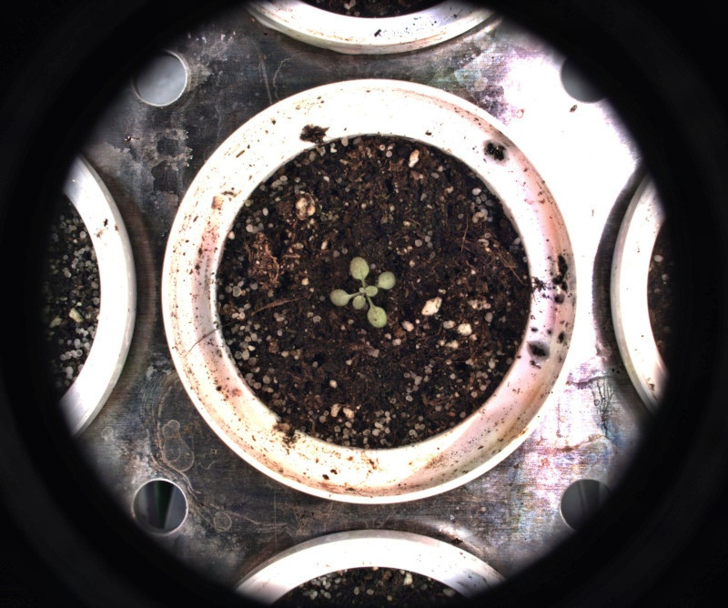

# CLAHE

## Description

Contrast Limited Adaptive Histogram Equalization (CLAHE).<br>Equalizes image using multiple histograms<br>**Real time**: True

## Usage

- **Pre-processing**: Transform the image to help segmentation, the image may not retain it's properties. Changes here will be ignored when extracting features
- **White balance**: Tools to help change white balance, depending on where those tools are set in the pipeline they or may not be ignored when extracting features

## Parameters

- Color space (color_space): no clue (default: HSV)
- Median filter size (odd values only) (median_filter_size): (default: 0)
- Clip limit (clip_limit): (default: 2)
- Tile grid size (tile_grid_size): (default: 8)
- Overlay text on top of images (text_overlay): Draw description text on top of images (default: 0)

## Example

### Source


### Parameters/Code

Default values are not needed when calling function

```python
from ipapi.ipt import call_ipt

image = call_ipt(ipt_id="IptClahe",
                 source="arabido_sample_plant.jpg",
                 color_space='RGB',
                 tile_grid_size=26)
```

### Result


