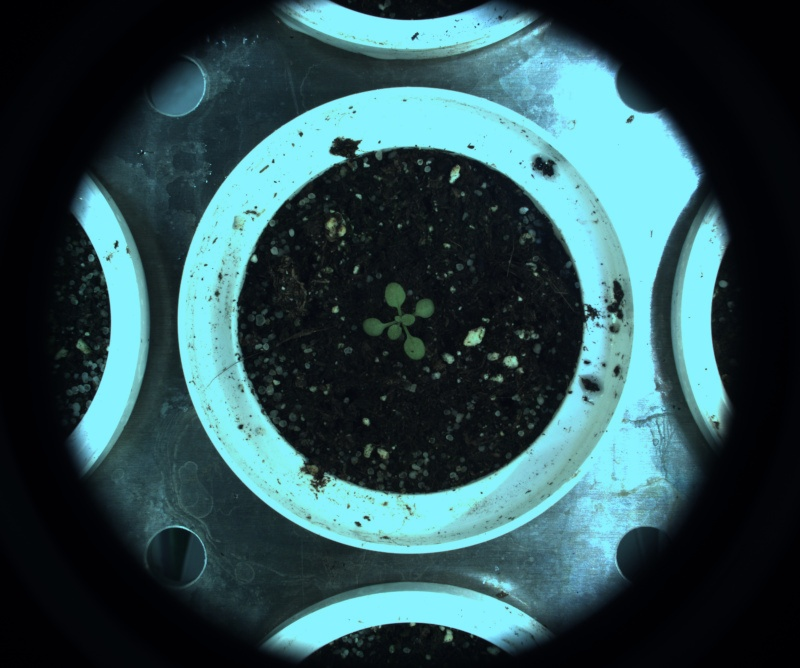

# Channel mixer

## Description

Creates an new image by combining 3 channels from the color spaces available.<br>
**Real time**: True

## Usage

- **Pre-processing**: Transform the image to help segmentation, the image may not retain it's properties. Changes here will be ignored when extracting features

## Parameters

- Select source file type (source_file): no clue (default: source)
- Color space (color_space): no clue (default: HSV)
- Weight of channel 1 (channel_1_weight): Factor used to multiply channel 1 values (default: 100)
- Weight of channel 2 (channel_2_weight): Factor used to multiply channel 2 values (default: 100)
- Weight of channel 3 (channel_3_weight): Factor used to multiply channel 3 values (default: 100)
- Output mode: (post_process): (default: rgb)
- Grey scale palette: (color_map): Grey scale palette (grey scale output only) (default: c_2)
- Build mosaic (build_mosaic): (default: 0)

---

## Example

### Source


### Parameters/Code

Default values are not needed when calling function

```python
from ipapi.ipt import call_ipt

image = call_ipt(ipt_id="IptChannelMixer",
                 source="arabido_sample_plant.jpg",
                 color_space='RGB',
                 channel_2_weight=96,
                 channel_3_weight=54,
                 color_map='i_8')
```

### Result


