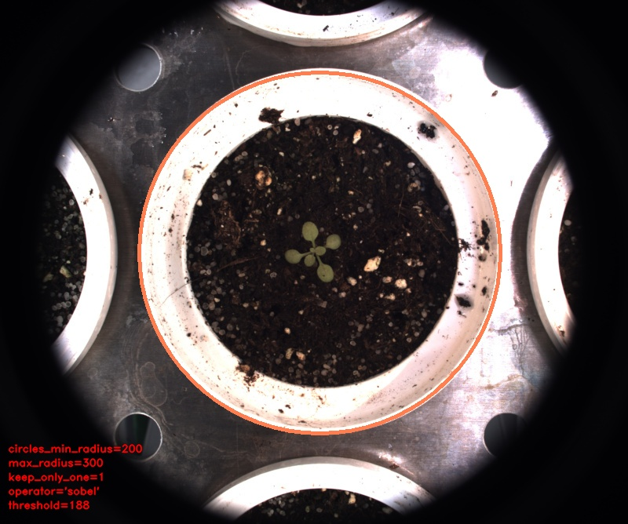

# Hough circles detector

## Description

Hough circles detector: Perform a circular Hough transform.<br>Can generate ROIs<br>**Real time**: False

## Usage

- **ROI (dynamic)**: Create a ROI after analyzing the image
- **Visualization**: Visualization tools

## Parameters

- ROI name (roi_name): (default: unnamed_roi)
- Select action linked to ROI (roi_type): no clue (default: keep)
- Select ROI shape (roi_shape): no clue (default: rectangle)
- Target IPT (tool_target): no clue (default: none)
- Select source file type (source_file): no clue (default: source)
- Channel (channel): (default: l)
- Minimal radius to consider (min_radius): All circles smaller than this will be ignored (default: 400)
- Maximal radius to consider (max_radius): All circles bigger than this will be ignored (default: 1000)
- Radius granularity (step_radius): Steps for scanning radius (default: 10)
- Maximum number of detected circles (max_peaks): Keeps only n best circles (default: 2)
- Minimum distance between two circles (min_distance): Remove circles that are too close (default: 20)
- Draw line width (line_width): (default: 4)
- Keep only closest, if not, ROI is larger circle (keep_only_one): (default: 0)
- Keep the closest circle closest to (target_position): (default: BOTTOM_CENTER)
- Maximum distance to root position (max_dist_to_root): (default: 1000)
- Draw max and min circles (draw_boundaries): (default: 0)
- Draw discarded candidates (draw_candidates): (default: 0)
- Contract/expand circle (expand_circle): (default: 0)
- Edge detection only (edge_only): (default: 0)
- Select edge detection operator (operator): (default: canny_opcv)
- Canny's sigma (canny_sigma): Sigma. (default: 2)
- Canny's first Threshold (canny_first): First threshold for the hysteresis procedure. (default: 0)
- Canny's second Threshold (canny_second): Second threshold for the hysteresis procedure. (default: 255)
- Kernel size (kernel_size): (default: 5)
- Threshold (threshold): Threshold for kernel based operators (default: 130)
- Apply threshold (apply_threshold): (default: 1)

---

## Example

### Source


### Parameters/Code

Default values are not needed when calling function

```python
from ipapi.ipt import call_ipt

circles = call_ipt(ipt_id="IptHoughCircles",
                   source="arabido_sample_plant.jpg",
                   min_radius=200,
                   max_radius=300,
                   keep_only_one=1,
                   operator='sobel',
                   threshold=188)
```

### Result


