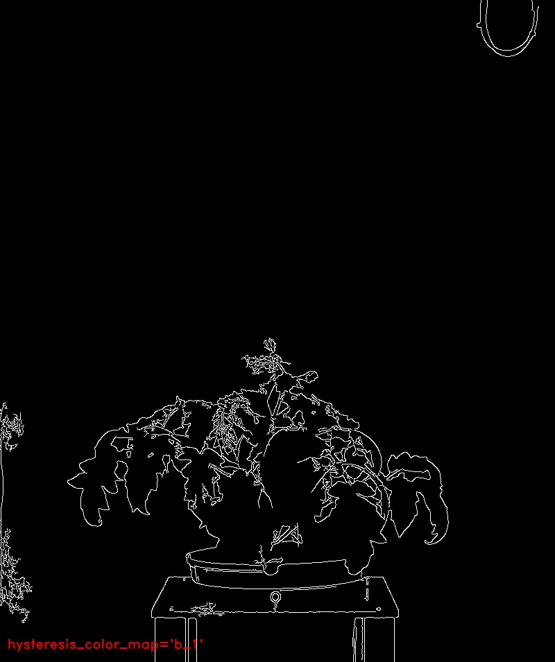

# Hysteresis threshold

## Description

From scikit-image: Apply hysteresis thresholding to image.<br>This algorithm finds regions where image is greater than high OR imageis greater than low and that region is connected to a region greater than high.  
In other words, a pixel is accepted if its value is greater than the upper threshold, or its value is higher than the lower threshold and one of has already been accepted.

**Real time**: False

## Usage

- **Threshold**: Creates a mask that keeps only parts of the image

## Parameters

- Edge detection only (edge_only): (default: 0)
- Select edge detection operator (operator): (default: canny_opcv)
- Canny's sigma (canny_sigma): Sigma. (default: 2)
- Canny's first Threshold (canny_first): First threshold for the hysteresis procedure. (default: 0)
- Canny's second Threshold (canny_second): Second threshold for the hysteresis procedure. (default: 255)
- Kernel size (kernel_size): (default: 5)
- Threshold (threshold): Threshold for kernel based operators (default: 130)
- Apply threshold (apply_threshold): (default: 1)
- Low threshold (low_threshold): (default: 10)
- High threshold (high_threshold): (default: 35)
- Select pseudo color map (color_map): (default: c_2)

---

## Example

### Source


### Parameters/Code

Default values are not needed when calling function

```python
from ipapi.ipt import call_ipt

mask = call_ipt(ipt_id="IptHysteresis",
                source="tomato_sample_plant.jpg",
                color_map='b_1')
```

### Result


