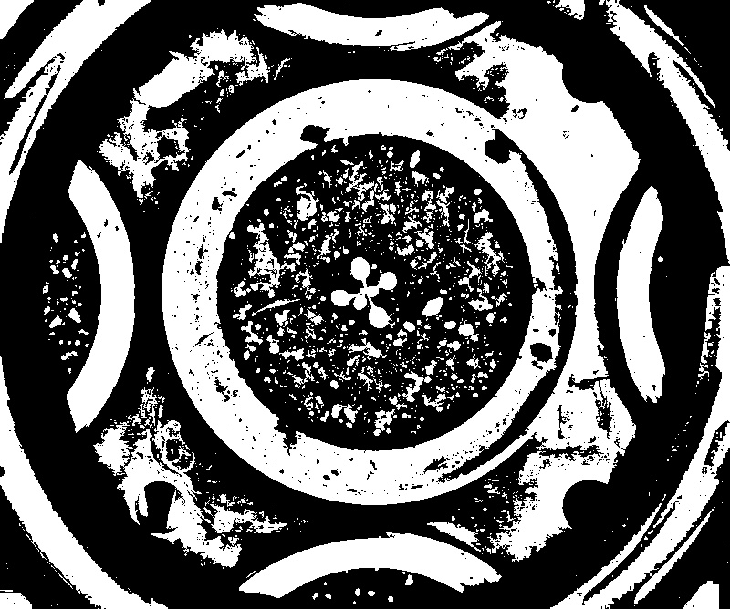

# Niblack binarization

## Description

Niblack binarization: From skimage - Applies Niblack local threshold to an array.<br><br> A threshold T is calculated for every pixel in the image using the following formula:<br> T = m(x,y) - k \* s(x,y)<br> where m(x,y) and s(x,y) are the mean and standard deviation of pixel (x,y) neighborhood defined by a<br> rectangular window with size w times w centered around the pixel. k is a configurable parameter that<br> weights the effect of standard deviation.<br>**Real time**: False

## Usage

- **Threshold**: Creates a mask that keeps only parts of the image

## Parameters

- Channel (channel): (default: l)
- Invert mask (invert_mask): Invert result (default: 0)
- Window size (window_size): (default: 25)
- k threshold formula (k): (default: 80)
- Morphology operator (morph_op): (default: none)
- Kernel size (kernel_size): (default: 3)
- Kernel shape (kernel_shape): (default: ellipse)
- Iterations (proc_times): (default: 1)
- Overlay text on top of images (text_overlay): Draw description text on top of images (default: 0)

## Example

### Source


### Parameters/Code

Default values are not needed when calling function

```python
from ipapi.ipt import call_ipt

mask = call_ipt(ipt_id="IptNiblack",
                source="arabido_sample_plant.jpg",
                window_size=57,
                k=0)
```

### Result


