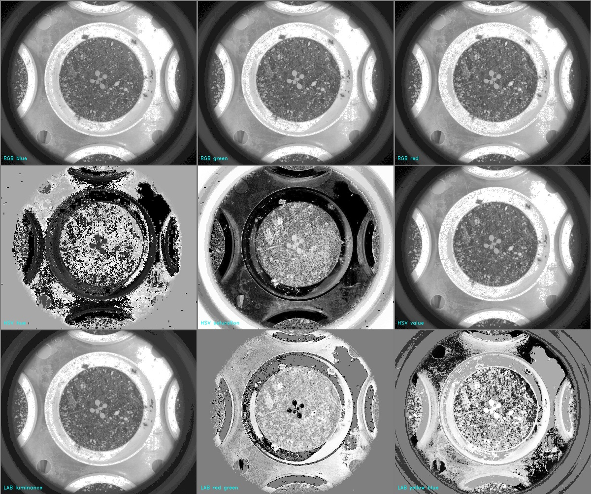

# Print color spaces

## Description

Print color spaces as individual channels or mosaics.
**Real time**: False

## Usage

- **Feature extraction**: Tools to extract features from a segmented image
- **Visualization**: Visualization tools

## Parameters

- Activate tool (enabled): Toggle whether or not tool is active (default: 1)
- RGB (rgb): (default: 1)
- LAB (lab): (default: 1)
- HSV (hsv): (default: 1)
- MSP (msp): Only for multispectral images (default: 1)
- Normalize channels (normalize): (default: 0)
- Add text to images (tag_images): (default: 0)
- Output data as single images (single): (default: 0)
- Output data as mosaics (mosaics): (default: 1)

## Example

### Source


### Parameters/Code

Default values are not needed when calling function

```python
from ipapi.ipt import call_ipt

image = call_ipt(
    ipt_id="IptPrintColorSpaces",
    source="arabido_small.jpg",
    return_type="result",
    msp=0,
    normalize=1,
    tag_images=1
)
```

### Result image



### Result data

|      key       |        Value        |
| :------------: | :-----------------: |
|     camera     |       unknown       |
|   date_time    | 2019-09-06 12:42:11 |
|    enabled     |          1          |
|   experiment   |    sample_images    |
|      hsv       |          1          |
|   image_name   |     vis_mosaic      |
|   img_height   |         668         |
|   img_width    |         800         |
|      ipt       | Print color spaces  |
| ipt_class_name | IptPrintColorSpaces |
|      lab       |          1          |
|    mosaics     |          1          |
|      msp       |          0          |
|   normalize    |          1          |
|     plant      |    arabido_small    |
|      rgb       |          1          |
|     single     |          0          |
|   tag_images   |          1          |
|  view_option   |        .jpg         |
