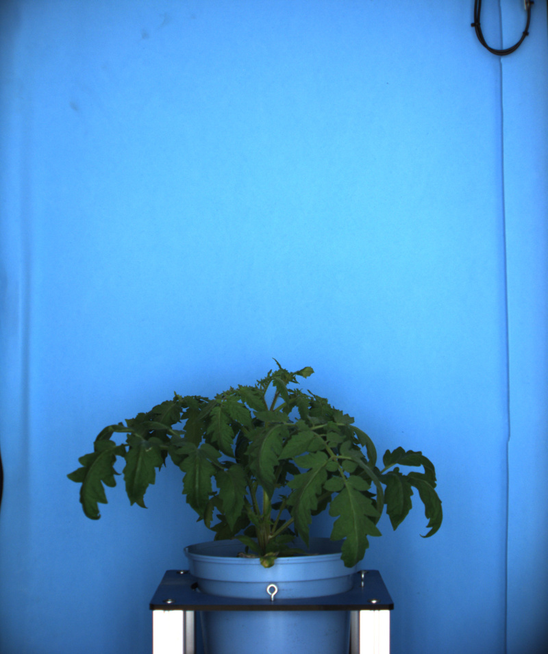
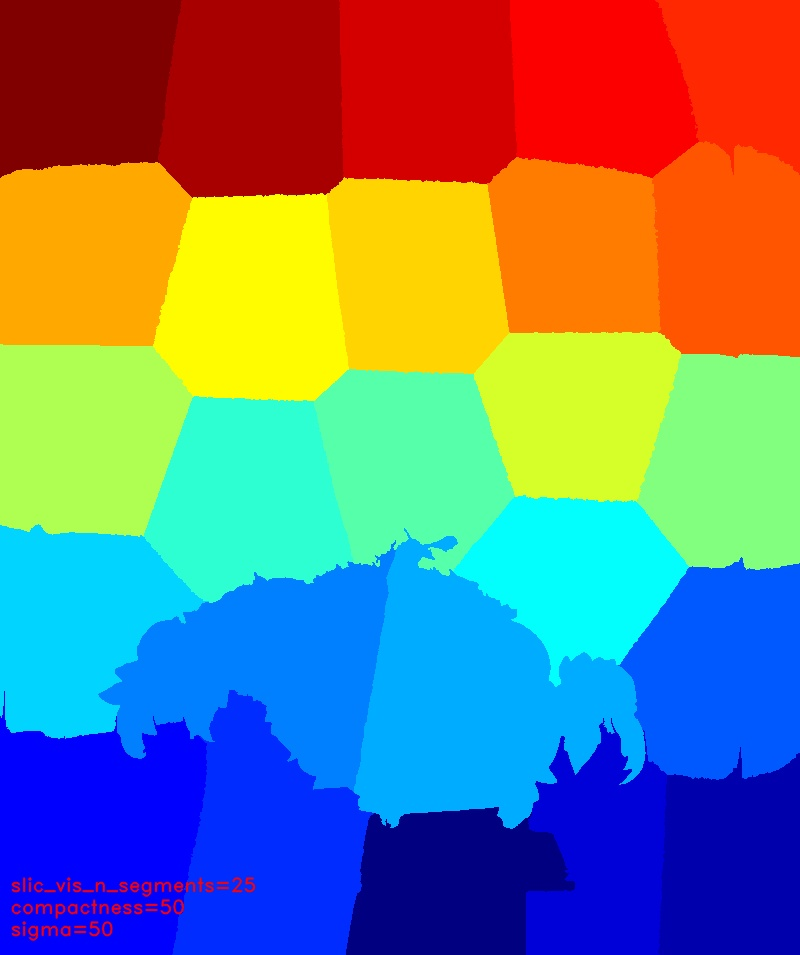

# Slic

## Description

From scikit-image: Segments image using k-means clustering in Color-(x,y,z) space.<br>

**Real time**: False

## Usage

- **Clustering**: Clustering tools

## Parameters

- Select source file type (source_file): no clue (default: source)
- Segment count (n_segments): (default: 3)
- Compactness (compactness): (default: 10)
- Sigma (sigma): (default: 100)
- Post process (post_process): (default: none)
- Label merger threshold (hierarchy_threshold): Regions connected by an edge with weight smaller than thresh are merged (default: 35)

## Example

### Source



### Parameters/Code

Default values are not needed when calling function

```python
from ipapi.ipt import call_ipt

labels = call_ipt(ipt_id="IptSlic",
                  source="tomato_sample_plant.jpg",
                  n_segments=25,
                  compactness=50,
                  sigma=25)
```

### Result


