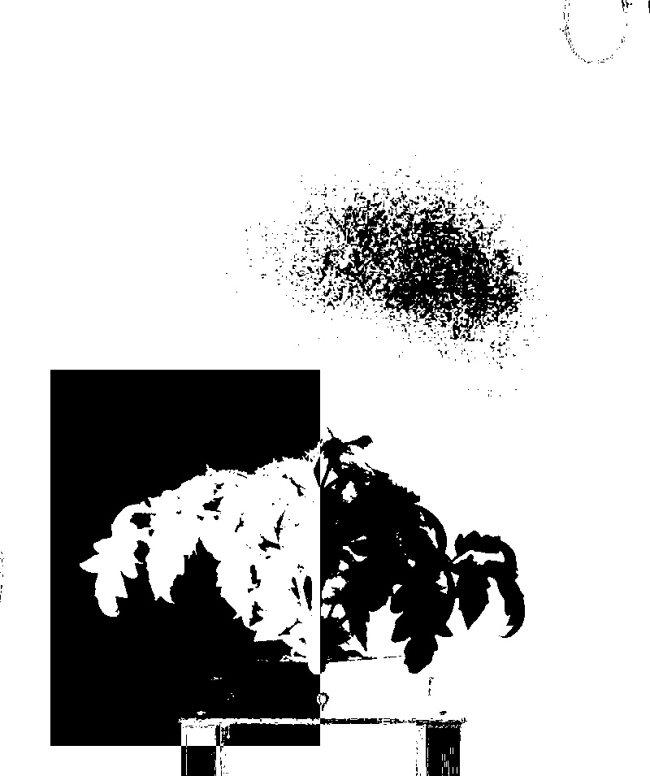

# Splitted range threshold

## Description

Performs range threshold with two sets of borders applied inside and outside of linked ROIs.

        ROIs must be provided through pipeline.
        If no ROIs are provided, all image will be considered within ROI.

**Real time**: True

## Usage

- **Threshold**: Creates a mask that keeps only parts of the image
- **Visualization**: Visualization tools

## Parameters

- Activate tool (enabled): Toggle whether or not tool is active (default: 1)
- Channel (channel): (default: h)
- Invert mask (invert): (default: 0)
- Name of ROI to be used (roi_names): Operation will only be applied inside of ROI (default: )
- ROI selection mode (roi_selection_mode): (default: all_linked)
- Threshold min value inside ROI (min_inside_t): (default: 0)
- Threshold max value inside ROI (max_inside_t): (default: 255)
- Threshold min value outside ROI (min_outside_t): (default: 0)
- Threshold max value outside ROI (max_outside_t): (default: 255)
- Median filter size (odd values only) (median_filter_size): (default: 0)
- Morphology operator (morph_op): (default: none)
- Kernel size (kernel_size): (default: 3)
- Kernel shape (kernel_shape): (default: ellipse)
- Iterations (proc_times): (default: 1)
- Overlay text on top of images (text_overlay): Draw description text on top of images (default: 0)
- Build mosaic (build_mosaic): If true edges and result will be displayed side by side (default: 0)
- Background color (background_color): Color to be used when printing masked image.

            if "None" is selected standard mask will be printed. (default: none)

## Example

### Source


### Parameters/Code

Default values are not needed when calling function

```python
from ipapi.ipt import call_ipt

mask = call_ipt(
    ipt_id="IptSplittedRangeThreshold",
    source="tomato_sample_plant.jpg",
    return_type="result",
    roi_names='left_crop',
    roi_selection_mode='all_named',
    max_inside_t=100,
    min_outside_t=100
)
```

### Result


